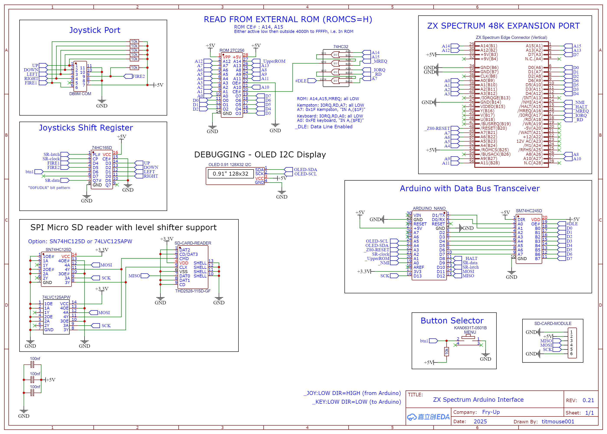

# ZX Spectrum 48k Game Cartridge Interface using an Arduino

Arduino-based ZX Spectrum 48K game loader - Load .SNA, .Z80, .SCR, and .TXT files from SD card. Fast game loading, on-screen game menu, selectable with Spectrum keyboard or Kempston joystick.
 
#### Latest Version 0.21 - with 90° cartridge design

### Interface Features

The interface loads games from a microSD card in about a second, using a slot at the back.
Games can be in **.sna** or ***.z80** format and stored either in folders or in the root directory of a FAT16-formatted SD card.

The built-in browser displays 24 titles per page on the ZX Spectrum screen. Navigation is done with Q/A and Enter, or alternatively with a joystick (via the built-in Kempston joystick port) or the interface menu button. If you enter multiple nested folders, the [/] option will take you back to the root (note: there is no parent-folder option).

The browser can also open **.scr** Spectrum screen files and **.txt** text files. These can be exited with any key. Pressing the menu button during a game returns you to the game browser.

For compatibility, the interface can also start up in the standard Spectrum ROM by holding down the menu button during power-up.

### Hardware Design (Ver 0.21)
I've been using JLCPCB with EasyEDA for my PCB design and fabrication, as EasyEDA is a free and simple-to-use circuit designer

### Hardware Design (Ver 0.21)

The hardware design uses a minimal chip count. It includes a 27C256 EPROM, which holds the Z80 machine code for accepting data and restoring the snapshot state. The Arduino manages data transfer to the ZX Spectrum, coordinating the interface. The interface primarily utilizes the data bus, with glue logic enabling the external ROM’s function.

<i>To address issues caused by returning to the original internal ROM after loading and starting a game, the setup uses a duplicated Spectrum ROM. The first half of the external EPROM contains the browser and game loading code. Once a game is loaded, the second half of the EPROM with the stock ROM takes over.</i>

- 74HC165D – The Arduino Nano has limited I/O pins, so a shift register is used to handle joystick inputs.
  - Both Fire A and Fire B are supported. The PCB menu select button is also mapped into the same shift register, leaving one bit free for future use.
  - The Arduino masks out the menu button from the joystick data juring gameplay.
- 74HC245D – Used as a transceiver (IC is unidirectional, but I've tied DIR to +5 V)
  - Enables high-impedance (Z) state (detaches Arduino from the data bus)
- 74HC32 – Provides the necessary glue logic to manage and monitor I/O signals.
- EPROM 27C256 – Stores all the Z80 code, including the browser and game launch routines.

https://oshwlab.com/titmouse001/zx-spectrum-interface (<i>link to older Ver 0.14</i>)

### Initial Prototypes...
 
#### Early Breadboard Prototype

#### Prototype Evolving...

#### Next Step - The ROM

#### Warning: No EPROMs were harmed in the making of this project… but they were definitely burned a few times!

  
#### Making Progress ROM On Stripboard

#### Ver0.01 First PCB - Mistakes Were Made!

##### Ver0.14 - Older Flat PCB

This version had extra navigation buttons on the PCB, until I worked out a way to read the Spectrum keyboard using a cunning HALT-pulse fudging protocol I came up with!

