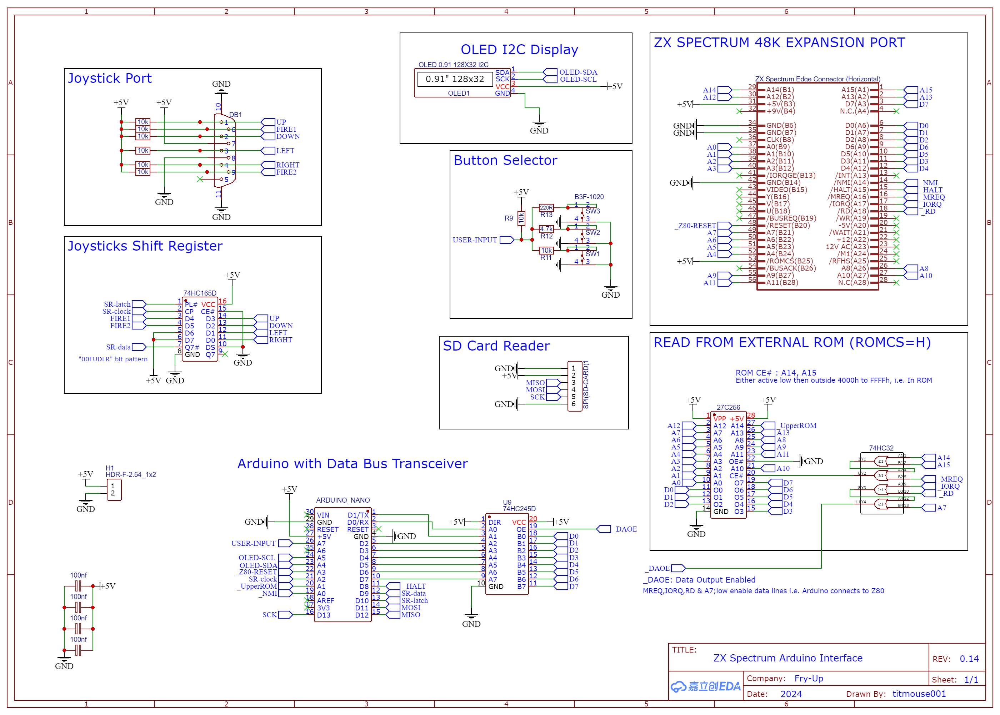

# ZX Spectrum 48k Game Loading Interface using an Arduino

Arduino-based ZX Spectrum 48K game loader - Load .SNA, .Z80, .SCR, and .TXT files from SD card. Fast game loading, on-screen game menu, selectable with Spectrum keyboard or Kempston joystick. New PCB (v0.21) with 90° cartridge design.
  
#### Latest Ver0.21

### Interface Features

The Interface includes an SD card slot (hidden at the back) for loading games from an SD card in around a second.
The ZX Spectrum display shows 24 games per page, scrollable via the Spectrum's keyboard, joystick or interface menu button.
Pressing the interface menu button during a game will return you to the game selection screen.
Currently, games must be in .sna or .z80 format and placed in the root directory of a FAT16-formatted SD card.
The interface can start up in the standard Spectrum ROM if you hold down the menu button during power-up.

## Hardware Design (Ver 0.21)
I've been using JLCPCB with EasyEDA for my PCB design and fabrication, as EasyEDA is a free and simple-to-use circuit designer

## PCB Created With EasyEDA (images from older Ver0.14)

## Hardware Design (Ver 0.14)

The hardware design uses a minimal chip count. It includes a 27C256 EPROM, which holds the Z80 machine code for accepting data and restoring the snapshot state. The Arduino manages data transfer to the ZX Spectrum, coordinating the interface. The interface primarily utilizes the data bus, with glue logic enabling the external ROM’s function.

To address issues caused by returning to the original internal ROM at game start, the setup uses a duplicated Spectrum ROM. The first half of the external EPROM contains the .SNA loading and launch code, allowing the ZX Spectrum to use the external ROM during startup. Once a game is loaded, the second half of the EPROM provides the stock ROM for normal operation. The Arduino Nano, with its limited pin count, employs a 74HC165D shift register to support a joystick. The 74HC245D transceiver allows the interface to enter a high-impedance (Z) state to avoid conflicts between the Arduino and the data bus. The 74HC32 provides the necessary glue logic to manage and monitor I/O signals.

https://oshwlab.com/titmouse001/zx-spectrum-interface (<i>link to older Ver 0.14</i>)

## Initial Prototypes...
##### Ver0.14 

  
#### Early Breadboard Prototype

#### Prototype Evolving...

#### Next Step - The ROM

#### Warning: No EPROMs were harmed in the making of this project… but they were definitely burned a few times!

  
#### Making Progress ROM On Stripboard

#### First PCB - Mistakes Were Made!

